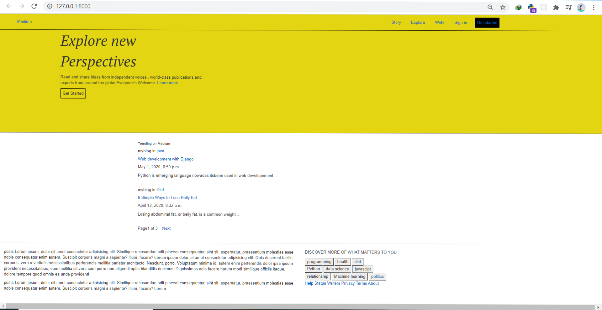

# Blog_App_django
Blog application with tagging and sharing feature built with django and postgresql

## Technologies used
> - Python 3.7
> - Django 2.2
> - Bootstrap 4
---
First Term 
This is an earlier version of the App
 
 - [x] Clone the Project
 - [x] Work on your own branch
 - [x] Submit a PR
 
 [Github profile](https://github.com/rnrashmi/)
